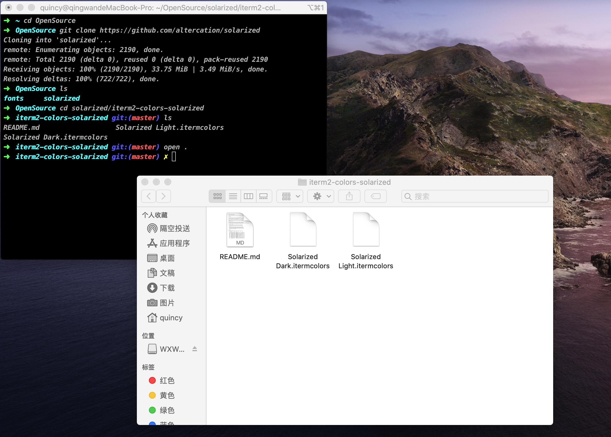

## 准备工作
* homebrew安装
* Git安装

## 安装iTerm2
> 可以直接去官网下载安装：[iTerm2官方下载地址](https://www.iterm2.com/)

安装完成后，在 `/bin` 目录下会多出一个 `zsh` 文件。
Mac系统默认使用 `dash` 作为终端，可以使用如下命令修改默认使用 `zsh` 作为终端：
`> chsh -s /bin/zsh`
如果想要再修改 `dash` 为默认终端，输入如下命令即可：
`> chsh -s /bin/bash`

## 安装 Oh My Zsh
> 安装 Oh My Zsh 有两种方式，即使用curl或wget进行安装，可以根据自己的环境或喜好选择一种方式安装即可。

```
# curl 安装方式
sh -c "$(curl -fsSL https://raw.githubusercontent.com/robbyrussell/oh-my-zsh/master/tools/install.sh)"
```
```
# wget 安装方式
sh -c "$(wget https://raw.githubusercontent.com/robbyrussell/oh-my-zsh/master/tools/install.sh -O -)"
```
oh-my-zsh开源地址：[oh-my-zsh](https://github.com/ohmyzsh/ohmyzsh)

## 安装PowerLine
> 安装PowerLine的方式依然很简单，只需要在终端输入如下命令即可：

`> pip install powerline-status --user`
PowerLine官网地址：[PowerLine官网](https://powerline.readthedocs.io/en/latest/installation.html)

## 安装PowerFonts
> 安装字体库首先需要将项目git clone至本地，然后执行源码中的 `install.sh` 即可。

选择一个目录，新建一个文件夹，如：~/OpenSource 。
在此文件夹下执行 `git clone` 命令：

```
# git clone
> git clone https://github.com/powerline/fonts.git --depth=1
> cd fonts

# run install shell
> ./install.sh
```

字体库安装完成后，设置iTerm2的字体，具体的操作是iTerm2 -> Preferences -> Profiles -> Text，在Font区域选中Change Font，然后找到Meslo LG字体。有L、M、S可选，看个人喜好选择。


## 安装配色方案
> 配色方案在使用VIM或Colorful Log时会变得非常有用，同时界面也不会一片黑绿一样死板。

同样使用git clone的方式下载源码进行安装：

```
> cd ~/OpenSource
> git clone https://github.com/altercation/solarized
> cd solarized/iterm2-colors-solarized/
# 打开当前文件夹
open .
```

在打开的finder窗口中，双击Solarized Dark.itermcolors和Solarized Light.itermcolors即可安装明暗两种配色。



再次进入iTerm2 -> Preferences -> Profiles -> Colors -> Color Presets中根据个人喜好选择这两种配色中的一种即可。


## 安装主题
> 下载agnoster主题，执行脚本安装。

```
> cd ~/OpenSource
> git clone https://github.com/fcamblor/oh-my-zsh-agnoster-fcamblor.git

> cd oh-my-zsh-agnoster-fcamblor/
# 将主题拷贝到oh my zsh的themes中
> ./install
```
拷贝完成后，执行命令打开zshrc配置文件，将ZSH_THEME设置为agnoster。


```
> vim ~/.zshrc
# 修改内容见上图，然后保存
# 按esc键调出vim命令
> :wq
```

## 安装高亮插件
> oh my zsh的高亮插件，安装方式与theme大同小异。

```python
> cd ~/.oh-my-zsh/custom/plugins/
> git clone https://github.com/zsh-users/zsh-syntax-highlighting.git
> vim ~/.zshrc
```
这时再次打开zshrc文件进行编辑。找到plugins，此时plugins中应该已经有了git，我们需要把高亮插件也加上。


**注意：请务必保证插件顺序，zsh-syntax-highlighting必须在最后一个**

然后在文件的最后一行添加如下内容：
`source ~/.oh-my-zsh/custom/plugins/zsh-syntax-highlighting/zsh-syntax-highlighting.zsh`
按esc键调出vim命令，保存修改内容

```
> :wq
> source ~/.zshrc
``` 

# 安装命令补全插件
> 跟代码高亮的安装方式一样，这也是一个zsh的插件，叫做zsh-autosuggestion，用于命令建议和补全。


```
> cd ~/.oh-my-zsh/custom/plugins/
> git clone https://github.com/zsh-users/zsh-autosuggestions
> vim ~/.zshrc
```
找到plugins，加上 `zsh-autosuggestions` 这个插件即可。

**至此，iTerm2 + Oh My Zsh配置完成。**